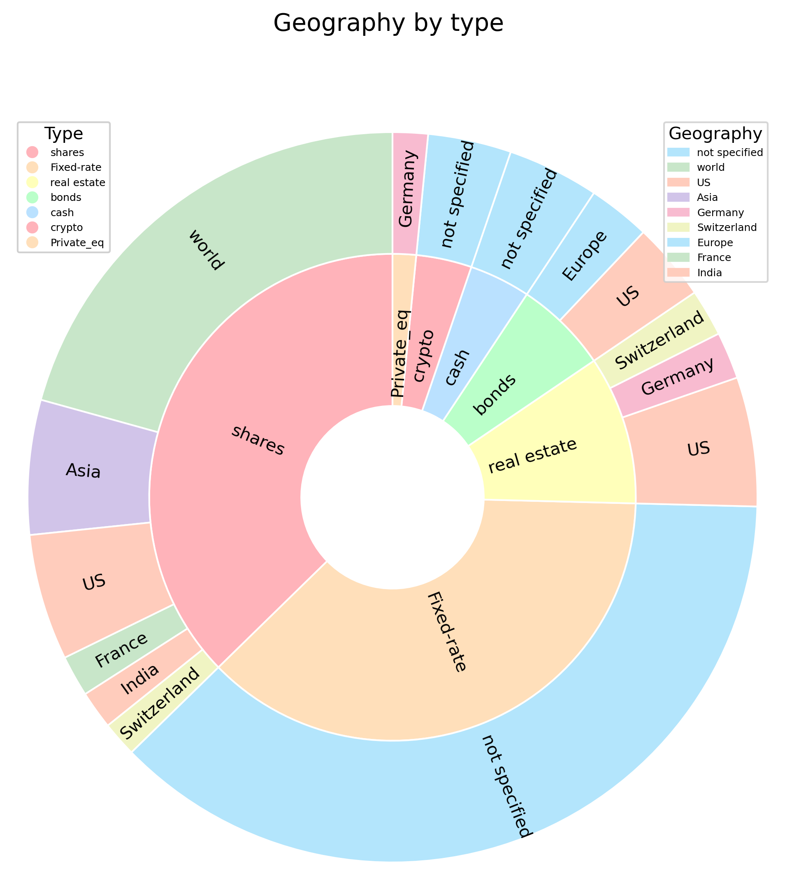

# persoFinViz
Personal Financial Visualization
***
Check your wealth allocations:  
Display your Personal Financial Visualization, to touch base on how much you have in asset categories (bonds, shares, liquidity, real estate).

***
Suggestions on how to install :  
* You should have python installed on your computer  
* Import all files from github to your computer
* Create a virtual environment and install required packages:

```shell
python -m venv my_env
source my_env/bin/activate  # On Windows: test_env\Scripts\activate
pip install -r requirements.txt
```


***

How to use this ?  
1/ In data/raw, create an input file with the same format as the example you'll find there  
2/ set this file name in src/visualize_01.py  
3/ In src, type: python visualize_01.py  (or use jupyter notebook with src/notebooks)  
4/ See your charts in images/  
***

  

